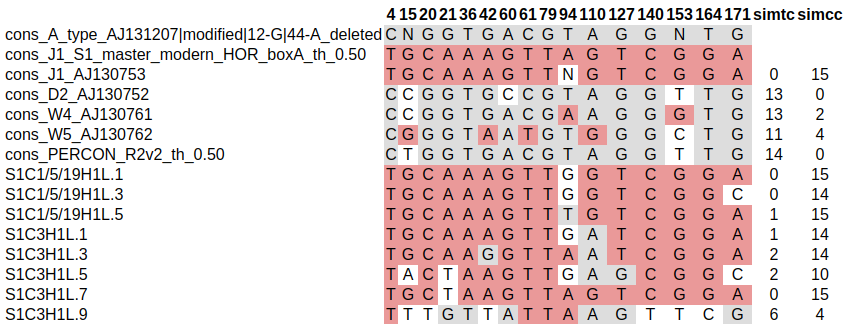
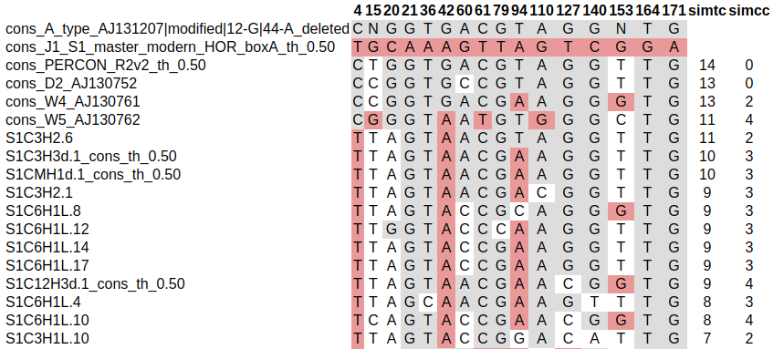
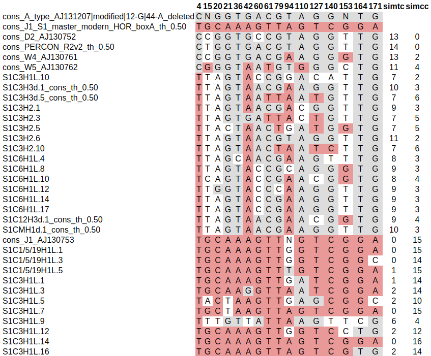

# haplotable
Prints an HTML table from the FASTA alignment useful in haplotypes analysis.

## Simple usage:
```
haplotable.R -i input-alignment.fasta
```
By default, the HTML report is saved to `out.html` (can be specified with `-o` option).

## Input alignment
Input is a FASTA alignment, were first sequence is type consensus, and second
sequence is class consensus. The analysis of the remaining sequences is made
relative to these first two, so it is important that they are selected correctly
and put in this order.

## Output HTML table
HTML table contains only positions that are identical to the type and class
consensus sequences without positions that are the same in both consensuses.
Columns with the positions of the first two lines are formatted with the color
specified in the style.css file (the first seven characters of the sequence name
are used for identification). The positions of the remaining rows are formatted
depending on whether the consensus base matches the corresponding base in each
of the sequences. The number of matches with the type and class consensuses in
each line is printed in the columns simtc and simcc respectively.
Option `-o` or `--output` allows you to specify a name of the output file name.


### Sorting by similarities with type consensus
Sorting rows (except the first two) in descending order of similarity values
with the type consensus printed in the simtc column.
By default, the order of rows in the table is the same as in the alignment,
to enable sorting, specify  `-s` or `--sortByTypeCons` option.


### Threshold for number of similarities with type consensus
You can set a threshold for the values of simtc by which the lines will be
divided into two groups and separately sorted by names.
This integer value can be specified with `-t` or `--thrd` option, for example
`-t 6` will give the result, as in the picture below.


## Base substitutions
In order to change some positions to others without changing the alignment you
can provide a tab delimited file with substitutions:
```
cons1	131	C
cons1	150	G/T
cons2	25	T/G/A
```
Each line contains a sequence name and position, which will be replaced by the
specified base or multiple bases (A/T/G).
